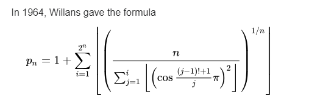

# Willans Formula

1964 Prime number formula by Willans.

Generally this is considered invalid because it is of no practical use since it is highly inefficient.

## More Info

https://en.wikipedia.org/wiki/Formula_for_primes